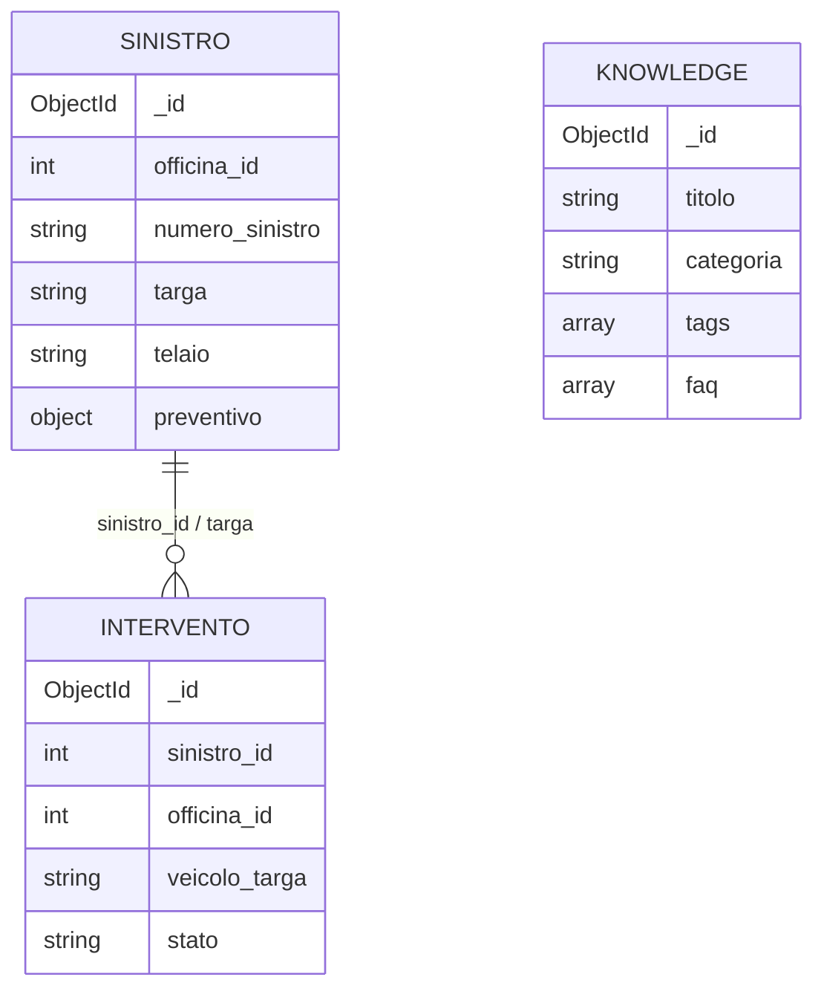

# Struttura collezioni JSON SafeClaim

Documento generato a partire da:

- `Prototipo.Proto_Sinistro_SC.json`
- `Prototipo.Proto_Knowledge_SC.json`
- `Prototipo.Proto_Intervento_SC.json`

Serve come riferimento rapido per un'AI o per uno sviluppatore che deve capire la parte documentale/MongoDB del prototipo SafeClaim.

## Panoramica

I file sono array JSON esportati in stile MongoDB.
Ogni documento usa `_id` con forma:

```json
{
  "_id": {
    "$oid": "..."
  }
}
```

Le tre collezioni rappresentano:

- `Proto_Sinistro_SC`: sinistri assegnati a officine, con dati veicolo, cliente, stato e preventivo.
- `Proto_Intervento_SC`: interventi tecnici collegati ai sinistri.
- `Proto_Knowledge_SC`: contenuti informativi/FAQ per utenti dell'app.

## Conteggio documenti

| File | Documenti | Ruolo |
| --- | ---: | --- |
| `Prototipo.Proto_Sinistro_SC.json` | 6 | pratiche di sinistro |
| `Prototipo.Proto_Intervento_SC.json` | 3 | lavorazioni/interventi tecnici |
| `Prototipo.Proto_Knowledge_SC.json` | 1 | knowledge base e FAQ |

## Mappa concettuale



Nota importante: `Proto_Intervento_SC.sinistro_id` contiene valori numerici (`1`, `2`, `3`), mentre `Proto_Sinistro_SC` usa `_id.$oid` come identificativo MongoDB e non contiene un campo numerico `id`. Quindi la relazione intervento-sinistro e' logica/applicativa, non direttamente garantita dal dump JSON.

## Proto_Sinistro_SC

Collezione principale dei sinistri gestiti dall'app.
Ogni documento descrive una pratica assegnata a un'officina, con dati cliente, veicolo, compagnia assicurativa, posizione eventuale del soccorso e preventivo.

### Campi principali

| Campo | Tipo | Note |
| --- | --- | --- |
| `_id.$oid` | ObjectId string | identificativo MongoDB del sinistro |
| `officina_id` | number | riferimento logico all'officina assegnata |
| `attivo` | boolean | indica se il sinistro e' attivo |
| `targa` | string | targa del veicolo coinvolto |
| `modello_veicolo` | string | modello del veicolo |
| `descrizione_danno` | string | descrizione testuale del danno |
| `data_sinistro` | datetime string | data/ora del sinistro |
| `cliente` | string | nome cliente |
| `compagnia_assicurativa` | string | compagnia coinvolta |
| `numero_sinistro` | string | codice pratica, es. `SIN-2026-23860` |
| `telaio` | string | numero telaio |
| `data_assegnazione` | datetime string | data/ora assegnazione all'officina |
| `priorita` | string | es. `bassa`, `media`, `urgente` |
| `stato_sinistro` | string | nel dump e' sempre `assegnato` |
| `note` | string | note operative sul cliente/contatti |
| `contatto_cliente` | object | telefono ed email |
| `posizione_soccorso` | GeoJSON Point | coordinate opzionali del soccorso |
| `stato` | string/null | stato applicativo, es. `accettato` |
| `preventivo` | object | dati preventivo e fattura |

### Oggetto contatto_cliente

| Campo | Tipo | Note |
| --- | --- | --- |
| `telefono` | string | numero telefono cliente |
| `email` | string | email cliente |

### Oggetto posizione_soccorso

| Campo | Tipo | Note |
| --- | --- | --- |
| `type` | string | valore GeoJSON, nel dump `Point` |
| `coordinates` | array[number] | coordinate `[longitudine, latitudine]` |

Nel dump alcune pratiche hanno `posizione_soccorso`, altre no.

### Oggetto preventivo

| Campo | Tipo | Note |
| --- | --- | --- |
| `data` | datetime string/null | data creazione preventivo |
| `costo_totale` | number/null | totale economico |
| `ore_manodopera` | number/null | ore previste |
| `giorni_previsti` | number/null | durata prevista |
| `stato` | string | `approvato` oppure `da_creare` |
| `dettaglio_voci` | array | righe di preventivo |
| `fattura` | object/null | nel dump e' `null` |

### Oggetto preventivo.dettaglio_voci

| Campo | Tipo | Note |
| --- | --- | --- |
| `descrizione` | string | descrizione ricambio/lavorazione |
| `importo` | number | costo della voce |
| `stato` | string | stato della voce, es. `fatto` |

### Valori osservati

- Priorita: `bassa` (3), `media` (1), `urgente` (2).
- Stato sinistro: `assegnato` (6).
- Stato pratica: `accettato` (5), `null` (1).
- Stato preventivo: `approvato` (1), `da_creare` (5).
- Compagnie: AXA Assicurazioni, Allianz Italia, Assicurazioni Lombarda, BNP Paribas Cardif, Zurich Connect.

## Proto_Intervento_SC

Collezione degli interventi tecnici eseguiti o pianificati dall'officina.
Ogni documento contiene il tipo di lavorazione, ricambi, foto prima/dopo, ore di manodopera e stato operativo.

### Campi principali

| Campo | Tipo | Note |
| --- | --- | --- |
| `_id.$oid` | ObjectId string | identificativo MongoDB dell'intervento |
| `sinistro_id` | number | riferimento logico al sinistro |
| `officina_id` | number | riferimento logico all'officina |
| `veicolo_targa` | string | targa del veicolo |
| `data_inizio` | datetime string | inizio intervento |
| `data_fine` | datetime string/null | fine intervento, se disponibile |
| `tipo_intervento` | string | es. carrozzeria, meccanica, elettronica |
| `descrizione_lavori` | string | descrizione operativa |
| `ricambi_utilizzati` | array | elenco ricambi |
| `manodopera_ore` | number | ore di lavoro registrate |
| `foto_prima` | array[string] | nomi/path foto prima dell'intervento |
| `foto_dopo` | array[string] | nomi/path foto dopo l'intervento |
| `note_tecnico` | string | note interne del tecnico |
| `stato` | string | stato lavorazione |
| `storico_stati` | array | presente solo in alcuni documenti |

### Oggetto ricambi_utilizzati

| Campo | Tipo | Note |
| --- | --- | --- |
| `nome` | string | nome ricambio |
| `codice` | string | codice interno ricambio |
| `costo` | number | costo ricambio |

### Oggetto storico_stati

| Campo | Tipo | Note |
| --- | --- | --- |
| `stato` | string | stato precedente o evento storico |
| `data` | datetime string | data/ora cambio stato |

### Valori osservati

- Stati intervento: `completato` (1), `in_corso` (1), `in_lavorazione` (1).
- Tipi intervento: `elettronica` (1), `meccanica` (1), `riparazione carrozzeria` (1).
- Alcuni interventi non hanno foto o ricambi.
- `data_fine` puo essere `null` anche quando lo stato e' `completato`; da verificare lato applicazione.

## Proto_Knowledge_SC

Collezione di contenuti informativi pubblicabili nell'app.
Il documento presente spiega come segnalare un sinistro e contiene allegati e FAQ.

### Campi principali

| Campo | Tipo | Note |
| --- | --- | --- |
| `_id.$oid` | ObjectId string | identificativo MongoDB del contenuto |
| `titolo` | string | titolo articolo |
| `categoria` | string | categoria, es. `procedure` |
| `tags` | array[string] | parole chiave |
| `contenuto` | string | testo principale |
| `destinatari` | array[string] | ruoli destinatari, es. `automobilista` |
| `allegati` | array | file collegati |
| `faq` | array | domande frequenti |
| `data_creazione` | date string | data creazione |
| `data_aggiornamento` | date string | ultimo aggiornamento |
| `versione` | number | versione contenuto |
| `pubblicato` | boolean | visibilita' pubblica |
| `attivo` | boolean | validita' logica del contenuto |

### Oggetto allegati

| Campo | Tipo | Note |
| --- | --- | --- |
| `nome` | string | nome file allegato |
| `storage_path` | string | path storage del file |

### Oggetto faq

| Campo | Tipo | Note |
| --- | --- | --- |
| `domanda` | string | domanda utente |
| `risposta` | string | risposta mostrata dall'app |

### Valori osservati

- Categoria: `procedure`.
- Destinatari: `automobilista`.
- Pubblicato: `true`.
- Attivo: `true`.
- Versione: `1`.

## Relazioni logiche con il database SQL

Questi JSON sembrano affiancare le tabelle SQL descritte in `STRUTTURA_Prototipo_SafeClaim.md`.
Le relazioni non sono vincolate dal dump, ma si possono interpretare cosi':

| Campo JSON | Collegamento probabile | Note |
| --- | --- | --- |
| `Proto_Sinistro_SC.officina_id` | `Utente.id` con ruolo `officina`, oppure tabella/officina mancante | nel SQL non esiste una tabella `Officina` dedicata |
| `Proto_Sinistro_SC.targa` | `Veicolo.targa` | collegamento per targa, non per ID |
| `Proto_Sinistro_SC.telaio` | `Veicolo.n_telaio` | collegamento possibile ma i dati di esempio non sono necessariamente allineati |
| `Proto_Intervento_SC.officina_id` | officina assegnata | stesso problema di `officina_id` nel sinistro |
| `Proto_Intervento_SC.veicolo_targa` | `Veicolo.targa` o `Proto_Sinistro_SC.targa` | collegamento testuale |
| `Proto_Intervento_SC.sinistro_id` | sinistro applicativo | non coincide direttamente con `_id.$oid` dei sinistri |
| `Proto_Knowledge_SC.destinatari` | `Utente.ruolo` | contenuti filtrabili per ruolo |

## Flusso applicativo suggerito

1. Un sinistro viene creato/assegnato in `Proto_Sinistro_SC`.
2. L'officina accetta o gestisce il sinistro tramite `stato` e `stato_sinistro`.
3. Se necessario viene creato un `preventivo` dentro il documento del sinistro.
4. Le lavorazioni vengono registrate in `Proto_Intervento_SC`.
5. Gli utenti possono consultare contenuti di supporto in `Proto_Knowledge_SC`, filtrati per `destinatari`, `categoria` o `tags`.

## Punti di attenzione per sviluppo o migrazione

- Manca una chiave comune esplicita tra sinistri e interventi: conviene aggiungere `sinistro_oid` oppure un campo numerico `sinistro_id` anche nei sinistri.
- `officina_id` e' numerico ma non e' chiaro se punti a `Utente.id`, a una tabella futura `Officina` o a una collezione separata.
- `veicolo_targa` e `targa` sono collegamenti testuali; se la targa cambia o viene corretta, la relazione puo rompersi.
- `data_fine` puo essere `null`; lo stato dell'intervento deve essere la fonte primaria solo se la logica applicativa lo conferma.
- `preventivo.fattura` e' sempre `null` nel dump: potrebbe essere uno spazio previsto per dati futuri.
- I file foto/allegati sono indicati come stringhe o path, non come documenti completi; serve un sistema storage esterno.
- Alcuni campi sono opzionali o assenti in parte dei documenti, quindi il codice deve trattare i JSON come documenti flessibili e non come record SQL rigidi.

