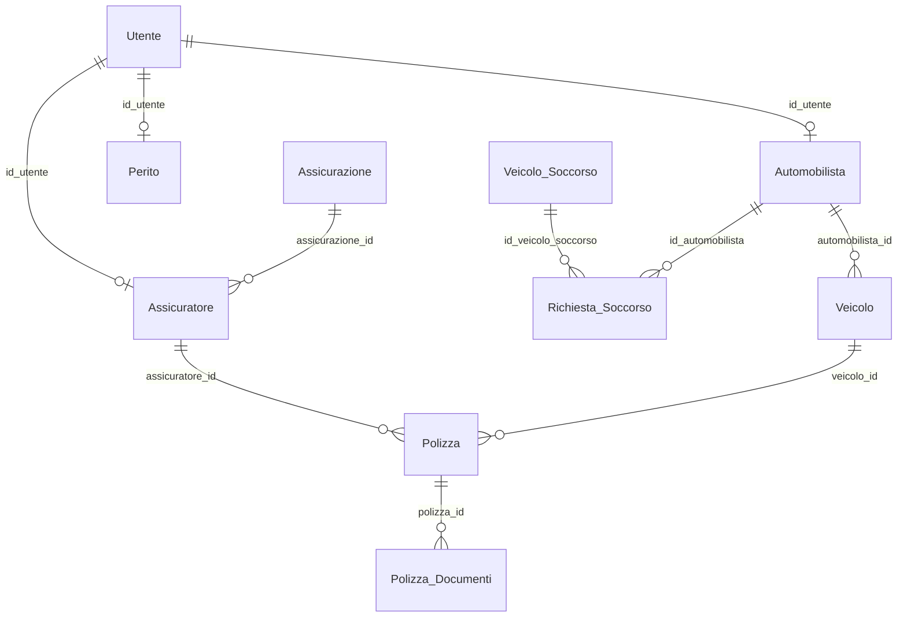

# Struttura database Prototipo_SafeClaim

Documento generato a partire da `Prototipo_SafeClaim.sql`.
Serve come riferimento rapido per un'AI o per uno sviluppatore che deve capire il modello dati SafeClaim.

## Panoramica

- Database: `Prototipo_SafeClaim`
- Motore tabelle: `InnoDB`
- Charset/collation: `utf8mb4`, `utf8mb4_unicode_ci`
- Server sorgente dump: MariaDB `10.11.14`
- Tabelle totali: 11
- Dominio applicativo: gestione utenti, automobilisti, assicurazioni, polizze, veicoli, documenti e richieste di soccorso.

## Mappa concettuale

Il database ruota attorno a `Utente`, che rappresenta l'account applicativo.
Alcuni ruoli hanno una tabella anagrafica dedicata:

- `Automobilista` estende `Utente`
- `Perito` estende `Utente`
- `Assicuratore` estende `Utente` ed e' collegato a `Assicurazione`

I veicoli sono in `Veicolo` e possono appartenere a un automobilista o, logicamente, a un'azienda.
Le polizze assicurative sono in `Polizza`, collegate a un veicolo e opzionalmente a un assicuratore.
I documenti sono referenziati tramite ID MongoDB, quindi il contenuto reale dei file non e' nel database SQL.

## Diagramma relazioni

Nota: `Richiesta_Soccorso.id_officina`, `Richiesta_Soccorso.id_sinistro`, `Veicolo.azienda_id` e `Veicolo_Soccorso.id_officina` sembrano riferimenti logici, ma nel dump non hanno una foreign key dichiarata. Inoltre non sono presenti tabelle `Officina`, `Azienda` o `Sinistro`.

## Tabelle

### Utente

Account applicativo comune a tutti i ruoli.

| Campo | Tipo | Note |
| --- | --- | --- |
| `id` | int | PK, auto increment |
| `nome` | varchar(50) | obbligatorio |
| `cognome` | varchar(50) | obbligatorio |
| `email` | varchar(100) | obbligatorio, unico |
| `telefono` | varchar(20) | opzionale |
| `password_hash` | varchar(255) | obbligatorio |
| `ruolo` | set | `admin`, `automobilista`, `perito`, `officina`, `assicuratore`, `azienda` |
| `data_registrazione` | datetime | default `current_timestamp()` |

Dati di esempio: 15 record.

### Automobilista

Anagrafica degli automobilisti collegati a un account utente.

| Campo | Tipo | Note |
| --- | --- | --- |
| `id` | int | PK, auto increment |
| `nome` | varchar(50) | obbligatorio |
| `cognome` | varchar(50) | obbligatorio |
| `cf` | varchar(16) | obbligatorio, unico |
| `id_utente` | int | FK verso `Utente.id` |

Dati di esempio: 3 record.

### Perito

Anagrafica dei periti collegati a un account utente.

| Campo | Tipo | Note |
| --- | --- | --- |
| `id` | int | PK, auto increment |
| `nome` | varchar(50) | obbligatorio |
| `cognome` | varchar(50) | obbligatorio |
| `cf` | varchar(20) | opzionale, unico |
| `id_utente` | int | FK verso `Utente.id` |

Dati di esempio: 2 record.

### Assicurazione

Compagnie assicurative.

| Campo | Tipo | Note |
| --- | --- | --- |
| `id` | int | PK, auto increment |
| `ragione_sociale` | varchar(100) | obbligatorio |
| `nome` | varchar(100) | opzionale |
| `telefono` | varchar(20) | opzionale |

Dati di esempio: 3 record.

### Assicuratore

Operatori assicurativi collegati a una compagnia e a un account utente.

| Campo | Tipo | Note |
| --- | --- | --- |
| `id` | int | PK, auto increment |
| `nome` | varchar(50) | obbligatorio |
| `cognome` | varchar(50) | obbligatorio |
| `cf` | varchar(16) | opzionale, unico |
| `assicurazione_id` | int | FK verso `Assicurazione.id` |
| `id_utente` | int | FK verso `Utente.id` |

Dati di esempio: 2 record.

### Veicolo

Veicoli assicurabili o associati a soggetti del sistema.

| Campo | Tipo | Note |
| --- | --- | --- |
| `id` | int | PK, auto increment |
| `targa` | varchar(10) | obbligatorio, unico |
| `n_telaio` | varchar(17) | opzionale, unico |
| `marca` | varchar(50) | opzionale |
| `modello` | varchar(50) | opzionale |
| `anno_immatricolazione` | year | opzionale |
| `automobilista_id` | int | FK verso `Automobilista.id`, opzionale |
| `azienda_id` | int | opzionale, nessuna FK nel dump |

Dati di esempio: 4 record.

### Polizza

Polizze assicurative associate ai veicoli.

| Campo | Tipo | Note |
| --- | --- | --- |
| `id` | int | PK, auto increment |
| `n_polizza` | varchar(50) | obbligatorio, unico |
| `compagnia_assicurativa` | varchar(100) | opzionale |
| `data_inizio` | date | obbligatorio |
| `data_scadenza` | date | obbligatorio |
| `massimale` | decimal(12,2) | opzionale |
| `tipo_copertura` | enum | `RCA`, `Kasko`, `Furto_Incendio`, `Full`; default `RCA` |
| `veicolo_id` | int | FK verso `Veicolo.id` |
| `assicuratore_id` | int | FK verso `Assicuratore.id`, opzionale |
| `documento_mongo_id` | varchar(24) | riferimento a documento MongoDB, opzionale |

Dati di esempio: 4 record.

### Polizza_Documenti

Documenti collegati a una polizza. I file sono esterni al DB SQL e referenziati tramite MongoDB.

| Campo | Tipo | Note |
| --- | --- | --- |
| `id` | int | PK, auto increment |
| `polizza_id` | int | FK verso `Polizza.id` |
| `mongo_doc_id` | varchar(24) | ID documento MongoDB |
| `tipo_documento` | enum | `polizza_pdf`, `quietanza`, `appendice`, `attestato_rischio` |
| `descrizione` | varchar(255) | opzionale |
| `data_inserimento` | datetime | default `current_timestamp()` |

Dati di esempio: 4 record.

### Documenti_Anagrafica

Documenti anagrafici generici associati a un tipo di entita. Non contiene l'ID SQL dell'entita, solo il tipo e l'ID MongoDB del documento.

| Campo | Tipo | Note |
| --- | --- | --- |
| `id` | int | PK, auto increment |
| `entita_tipo` | enum | `automobilista`, `perito`, `assicuratore`, `officina`, `azienda` |
| `mongo_doc_id` | varchar(24) | ID documento MongoDB |
| `tipo_documento` | varchar(50) | es. patente, carta identita, abilitazione |
| `descrizione` | varchar(255) | opzionale |
| `data_inserimento` | datetime | default `current_timestamp()` |
| `data_scadenza` | date | opzionale |

Dati di esempio: 5 record.

### Veicolo_Soccorso

Mezzi usati dalle officine per il soccorso stradale.

| Campo | Tipo | Note |
| --- | --- | --- |
| `id` | int | PK, auto increment |
| `id_officina` | int | obbligatorio, nessuna FK nel dump |
| `targa` | varchar(10) | obbligatorio |
| `tipo` | varchar(50) | opzionale, es. carroattrezzi o furgone |
| `stato` | enum | `disponibile`, `in_servizio`, `manutenzione`; default `disponibile` |

Dati di esempio: 5 record.

### Richiesta_Soccorso

Richieste di soccorso stradale effettuate dagli automobilisti.

| Campo | Tipo | Note |
| --- | --- | --- |
| `id` | int | PK, auto increment |
| `id_sinistro` | int | opzionale, nessuna FK nel dump |
| `id_automobilista` | int | FK verso `Automobilista.id` |
| `id_officina` | int | opzionale, nessuna FK nel dump |
| `id_veicolo_soccorso` | int | FK verso `Veicolo_Soccorso.id`, opzionale |
| `data_richiesta` | datetime | obbligatorio |
| `orario_arrivo` | datetime | opzionale |
| `durata_soccorso` | int | opzionale, presumibilmente minuti |
| `stato` | enum | `in_attesa`, `assegnata`, `in_corso`, `completata`, `annullata`; default `in_attesa` |

Dati di esempio: 4 record.

## Relazioni dichiarate nel dump

| Da | A | Cardinalita logica |
| --- | --- | --- |
| `Automobilista.id_utente` | `Utente.id` | un utente puo avere una anagrafica automobilista |
| `Perito.id_utente` | `Utente.id` | un utente puo avere una anagrafica perito |
| `Assicuratore.id_utente` | `Utente.id` | un utente puo avere una anagrafica assicuratore |
| `Assicuratore.assicurazione_id` | `Assicurazione.id` | una assicurazione ha molti assicuratori |
| `Veicolo.automobilista_id` | `Automobilista.id` | un automobilista puo avere molti veicoli |
| `Polizza.veicolo_id` | `Veicolo.id` | un veicolo puo avere molte polizze nel tempo |
| `Polizza.assicuratore_id` | `Assicuratore.id` | un assicuratore puo gestire molte polizze |
| `Polizza_Documenti.polizza_id` | `Polizza.id` | una polizza puo avere molti documenti |
| `Richiesta_Soccorso.id_automobilista` | `Automobilista.id` | un automobilista puo aprire molte richieste |
| `Richiesta_Soccorso.id_veicolo_soccorso` | `Veicolo_Soccorso.id` | un mezzo puo essere assegnato a molte richieste nel tempo |

## Indici e vincoli unici rilevanti

- `Utente.email` e' unico.
- `Automobilista.cf`, `Perito.cf`, `Assicuratore.cf` sono unici.
- `Veicolo.targa` e `Veicolo.n_telaio` sono unici.
- `Polizza.n_polizza` e' unico.
- Sono presenti indici sui principali campi FK.

## Integrazione con MongoDB

Il database SQL non salva i file/documenti binari.
Usa invece campi stringa da 24 caratteri compatibili con ObjectId MongoDB:

- `Polizza.documento_mongo_id`
- `Polizza_Documenti.mongo_doc_id`
- `Documenti_Anagrafica.mongo_doc_id`

Questo indica una architettura ibrida: dati relazionali in MariaDB/MySQL, documenti in MongoDB.

## Punti di attenzione per sviluppo o migrazione

- Mancano nel dump le tabelle `Officina`, `Azienda` e `Sinistro`, anche se alcuni campi sembrano riferirsi a queste entita.
- `Documenti_Anagrafica` indica solo `entita_tipo`, ma non contiene un `entita_id`; quindi non permette di collegare direttamente un documento a uno specifico record SQL.
- `Utente.ruolo` e' un `set`, quindi tecnicamente un utente puo avere piu ruoli. L'applicazione deve decidere se usarlo come ruolo singolo o multiplo.
- Alcune password nei dati di esempio sembrano non hashate realmente, ad esempio `password123` o `temp_password`; non usare questi dati come riferimento di sicurezza.
- Il dump contiene dati di test con date di polizze 2024-2025 e registrazioni 2026.

